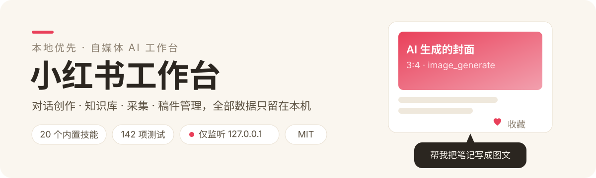
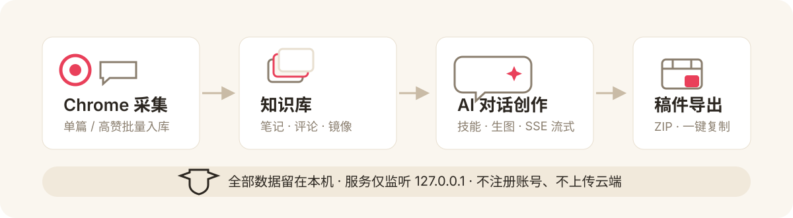

<p align="center">
  
</p>

本地优先的自媒体 AI 工作台（[xiaohongshu-workbench](https://github.com/zackzhangkai/xiaohongshu-workbench)）：Node/Express 后端 + React 前端，界面为中文。把对话创作、知识库、小红书采集、稿件管理、字幕、本地语音/视频处理放进一台只绑定 `127.0.0.1` 的服务里——数据不出本机，不注册账号。

## 工作流

<p align="center">
  
</p>

## 功能

- **AI 对话**：OpenAI 兼容 `/chat/completions` 流式输出（SSE），内置 `image_generate` 工具多轮调用（最多 8 轮），工具调用与结果完整持久化到会话历史。
- **多供应商模型设置**：界面里配置多个聊天/生图供应商（地址、模型、密钥），支持连通性测试与模型目录探测；生图兼容 OpenAI Images 同步、DashScope 同步/异步三种协议，不自动跨协议回退。
- **知识库**：笔记 CRUD、文档导入、导出包；重复采集自动去重，手动编辑的字段在再次采集时保留。
- **小红书采集插件**：仓库内置 Chrome MV3 扩展（`extensions/xhs-collector`），在知识库「采集插件」面板配对后，可单篇采集图文与已加载评论，也可按主题搜索高赞前十批量入库。轻量采集场景另有独立的 [xiaohongshu-chrome-plugin](https://github.com/zackzhangkai/xiaohongshu-chrome-plugin) 可选。
- **本地文件夹镜像**：每篇采集的笔记同时落一份 `note.md + images/`（默认 `data/exports/collector/`，`COLLECTOR_SYNC_DIR` 可改），Obsidian 等工具可直接读。
- **稿件与导出**：稿件版本管理、配图收集、Markdown/ZIP 导出。
- **字幕工程**：字幕编辑器、SRT/工程文件导出、本地渲染叠层（`scripts/render_subtitle_layers.py`）。
- **本地语音转写**：可选本地转写（`scripts/transcribe_local.py`，经 `TRANSCRIBE_PYTHON` / `TRANSCRIBE_MODEL` 配置），不依赖云端。
- **自动化**：日程任务、选题订阅解析（`scripts/parse_feed.py`）。

## 快速开始

需要 Node.js 18+（转写等 Python 脚本为可选依赖）。

```bash
npm install
npm start        # 构建前端并启动服务：http://127.0.0.1:8787
```

1. 首次启动无需密钥，打开 `http://127.0.0.1:8787` 进入「设置」配置模型供应商（或在 `.env` 里预置，见 `.env.example`）。
2. 想用采集插件：`chrome://extensions` → 开发者模式 →「加载已解压的扩展程序」→ 选择 `extensions/xhs-collector`，再到工作台「知识库 → 采集插件」显示配对码完成配对。
3. 开发模式：`npm run dev`（服务 + Vite 热更新，前端跑在 5173，代理 API 到服务端口）。

## 配置

`.env`（git 忽略，模板见 `.env.example`）：

| 变量 | 说明 |
| --- | --- |
| `DASHSCOPE_API_KEY` | 旧版默认密钥，作为聊天/生图密钥的兜底 |
| `CHAT_MODEL` / `IMAGE_MODEL` | 默认模型名（可在界面覆盖） |
| `PORT` | 服务端口，默认 8787 |
| `DATA_DIR` | 数据目录，默认仓库内 `data/`（私有数据，勿提交） |
| `COLLECTOR_SYNC_DIR` | 采集镜像目录；相对路径按 `DATA_DIR` 解析，空值禁用 |
| `TRANSCRIBE_PYTHON` / `TRANSCRIBE_MODEL` | 本地转写脚本解释器与模型 |

界面保存的模型配置存于 `data/model-config.json`（0600 权限原子写入），优先级高于环境变量；密钥只在本地，接口只返回是否已配置。

## 技能目录

仓库内置 20 个原创技能（`skills/`，均为本项目原创内容，MIT 随仓库授权）：小红书标题公式库、图文成品、内容形态判断、成套图片编排、生图提示词整理、知识库仿写、选题挖掘、评论区洞察、风格底盘、文章改写、公众号排版、口播稿、封面设计、视频分镜、配音稿设计、公众号成品、X 内容改写、母版拆解、运营日报、技能创建。对话输入 `@` 即可选用；你也可以按同样格式放入自己的技能包（每个目录一个 `SKILL.md`，可带 `references/`）。

## 隐私与安全

- 服务只绑定 `127.0.0.1`；笔记、会话、密钥等全部落在本地 `data/`，原子写入且密钥文件 0600。
- 采集插件不读 Cookie、不后台运行，只在你点击时读取当前页面；图片仅从小红书官方 CDN 下载并校验文件头，单图 5MB、总量 24MB 上限。
- 所有供应商/工具失败都以 SSE `error` 事件透出到界面，不静默吞错。

## 开发与测试

```bash
npm test         # node --test tests/*.test.js
npm run build    # vite build → dist/
```

## English

A local-first Chinese-language AI workbench for content creators: Express + React, loopback-only, with streaming chat over any OpenAI-compatible endpoint, an embedded Chrome MV3 collector for Xiaohongshu (rednote) posts, a knowledge base with Markdown folder mirroring, manuscript/version management, subtitles, and optional local transcription — all data stays on your machine. MIT licensed.

> ⚠️ 采集功能请只用于公开内容，遵守平台条款并尊重原作者权益；导出内容仅供个人学习与备份。

## License

[MIT](LICENSE)
